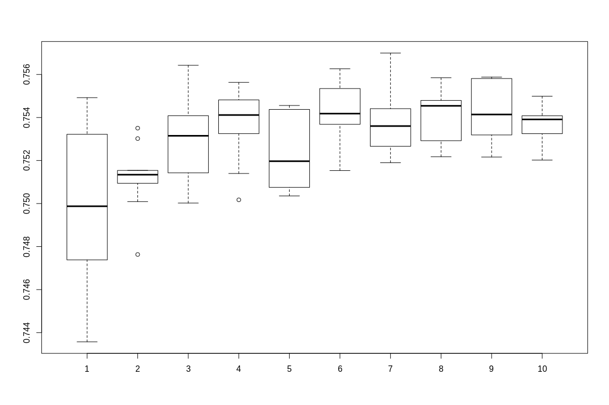

## Methods

In this RMD documents there are 5 methods demonstrated:

- SCT
- XGBoost (with SCT 1\hat(st) layer)
- Lassosum
- Random Forest (with SCT 1\hat(st) layer)
- Neural Net (with SCT 1\hat(st) layer)

More promising (SCT, XGBoost, Lassosum, Random Forest) are place first, and Neural Net are included for reference.

For some reason I can not get Keras to work with SCT first layer (always return AUC of 0.5). This can either be a problem of the target function (I have yet to find a good function that operate well), or a bug within Keras (unlikely). Or perhap the Euclid distance after C+T layer are too small for neuralnet - that's why regression based method work better?

## Required packages:

- bigstatsr
- bigsnpr
- lassosum
- data.table
- xgboost
- ranger
- keras


```r
library(bigstatsr)
library(bigsnpr)
library(lassosum)
library(data.table)
library(xgboost)
library(ranger)
library(keras)
```

## Dataset

*Please change working direction in `directory`*

I use the "Simus" simulated dataset provided by Florian. This dataset contain ~650,000 SNPs in 2 chromosomes. 20% of them are cases and the rest 80% are controls.


```r
setwd(directory) 
# Train data
sumstats <- bigreadr::fread2(file_sumstat)
# snp_readBed(paste(file_train, "bed", sep='.'))
train <- snp_attach(paste(file_train, "rds", sep='.'))
G.train <- train$genotypes
CHR <- train$map$chromosome
POS <- train$map$physical.pos
NCORES <- nb_cores()
lpval <- -log10(sumstats$pval)
y.train <- train$fam$affection

# Test data
# snp_readBed(paste(file_test, "bed", sep='.'))
test <- snp_attach(paste(file_test, "rds", sep='.'))
G.test <- test$genotypes
# 
```

## C+T step
Generating a matrix of C+T with varied clumping radius and $p-value$ thresholds.

$\beta s$ and $p-values$ are aquired in sumstats file (see `sumstats.txt`)


```r
all_keep <- snp_grid_clumping(G.train, CHR, POS, lpval, ncores = NCORES)
PRS <-snp_grid_PRS(G.train,all_keep = all_keep, betas = sumstats$beta,lpval)
PRS_test <- snp_grid_PRS(G.test, all_keep = all_keep, betas = sumstats$beta,lpval)
```

Other than SCT, other methods require DataFrame or R Matrix than FBM to manage data. I converted the FBM output of C+T to DataFrame and change the corresponding columns.


## Data treatment: Oversampling

To oversampling I extract all positive (*affection = 1*), and append them a number of times. For this simulated dataset, I enhanced the number of cases 10 times, thus the ratio become ~70:30 (from 20:80).


```r
y_case <- which(train$fam$affection %in% c(1))
for (i in seq(1, 10)){
  y.train <- append(y.train, train$fam$affection[y_case])
  ds <- rbind(ds, PRS[y_case,])
}
ds.FBM <- as_FBM(ds)
```

## Method 1: SCT

No parameters required. Combining (Sparse Logistic Regression) C+T predictors for best result.


```r
AUC(pred = pred.SCT, test$fam$affection)
```

```
## [1] 0.7816448
```

## Method 2: XGBoost

XGBoost provide slightly better result compare to SCT. However this result heavily depend on booster and objective selection. Experiments shown that **gblinear** booster with **count:poisson** objective give the best results.

For experimentation, I run 9 different *max_depth* and 9 *nrounds*. Each combination is repeated 10 times and the mean value calculated to rule out the randomess of *gblinear* booster


```r
AUCs
```

```
##            [,1]      [,2]      [,3]      [,4]      [,5]      [,6]
##  [1,] 0.7807610 0.7814555 0.7822616 0.7822460 0.7821162 0.7819296
##  [2,] 0.7814782 0.7819920 0.7821411 0.7819715 0.7820371 0.7820205
##  [3,] 0.7811813 0.7816952 0.7818745 0.7819274 0.7821436 0.7819948
##  [4,] 0.7808610 0.7814560 0.7818701 0.7819860 0.7820152 0.7819697
##  [5,] 0.7809649 0.7812360 0.7819548 0.7819869 0.7821311 0.7819497
##  [6,] 0.7810363 0.7815769 0.7821364 0.7820270 0.7819269 0.7818923
##  [7,] 0.7810759 0.7817207 0.7820848 0.7818963 0.7820759 0.7819254
##  [8,] 0.7812551 0.7814734 0.7818455 0.7819321 0.7820631 0.7819179
##  [9,] 0.7817412 0.7815583 0.7818585 0.7820500 0.7820008 0.7819445
## [10,]        NA        NA        NA        NA        NA        NA
##            [,7]      [,8]      [,9] [,10]
##  [1,] 0.7818084 0.7816425 0.7814607    NA
##  [2,] 0.7817557 0.7817217 0.7814089    NA
##  [3,] 0.7818202 0.7815279 0.7815283    NA
##  [4,] 0.7817682 0.7815296 0.7814303    NA
##  [5,] 0.7817345 0.7817174 0.7813653    NA
##  [6,] 0.7817838 0.7815636 0.7815245    NA
##  [7,] 0.7818637 0.7818001 0.7815793    NA
##  [8,] 0.7818620 0.7815770 0.7814361    NA
##  [9,] 0.7817729 0.7815309 0.7814066    NA
## [10,]        NA        NA        NA    NA
```

```r
boxplot(AUCs)
```

<!-- -->

## Method 3: Lassosum

Lassosum use L1 regularization to better fit the regression model.

For basic L1 regularization of Linear Regression, 2 metaparameters are required: a learning rate $\alpha$ and a regularization parameter $\lambda$. However, *lassosum* does not require these parameters, as the software automatically scan the parameters space and select the best $\alpha$ and $\lambda$


```r
AUC(v$best.pgs, v$pheno)
```

```
## [1] 0.7308175
```

## Method 4: Random Forest

Random forest also give good AUC (above 70%, but less than other methods except for *keras*). The result highly dependen on the number of trees (more trees equals more convergence), and the learning rate also contribute to an lesser extend.

The code in this session will sweep through the parameters: 1 to 10 trees and alpha from 0.1 to 1 (0.1 increment).


```r
AUCs
```

```
##            [,1]      [,2]      [,3]      [,4]      [,5]      [,6]
##  [1,] 0.7532205 0.7535048 0.7564268 0.7501722 0.7507132 0.7515333
##  [2,] 0.7440113 0.7530198 0.7540833 0.7532506 0.7518778 0.7546351
##  [3,] 0.7545732 0.7500895 0.7514272 0.7556325 0.7545590 0.7539930
##  [4,] 0.7549227 0.7515300 0.7500226 0.7548174 0.7503537 0.7543692
##  [5,] 0.7488554 0.7515392 0.7508904 0.7535265 0.7544863 0.7536828
##  [6,] 0.7501346 0.7512984 0.7525976 0.7547204 0.7520592 0.7536302
##  [7,] 0.7496137 0.7509414 0.7527130 0.7549386 0.7512415 0.7553466
##  [8,] 0.7435724 0.7513862 0.7545431 0.7513971 0.7525416 0.7559703
##  [9,] 0.7513695 0.7512825 0.7537756 0.7543274 0.7507516 0.7562646
## [10,] 0.7473798 0.7476314 0.7535859 0.7539036 0.7543751 0.7537062
##            [,7]      [,8]      [,9]     [,10]
##  [1,] 0.7541560 0.7521771 0.7544930 0.7532481
##  [2,] 0.7547923 0.7526261 0.7558700 0.7539353
##  [3,] 0.7526620 0.7529212 0.7531896 0.7540800
##  [4,] 0.7532573 0.7556534 0.7528978 0.7538868
##  [5,] 0.7518979 0.7547931 0.7558106 0.7535190
##  [6,] 0.7544119 0.7547555 0.7558792 0.7548132
##  [7,] 0.7524614 0.7543283 0.7537857 0.7549896
##  [8,] 0.7533702 0.7535374 0.7533777 0.7520208
##  [9,] 0.7569953 0.7558482 0.7558123 0.7530600
## [10,] 0.7538342 0.7547547 0.7521612 0.7539888
```

```r
boxplot(AUCs)
```

<!-- -->

## Method 5: Nerual net (Keras)

For some reason, *keras* cannot return good result; the prediction always biased to controls. Even with adjusted weights and oversampling, the bias is still there and AUC is always $0.5$. I included it here in case I figure it out in the future.

In this example, I put a 10:1 weight ratio between case and control.


```r
y.train <- train$fam$affection

model <- keras_model_sequential() 
model %>%
 layer_dense(units = 1000, activation = "softmax", input_shape = c(ncol(ds)), kernel_regularizer=regularizer_l1(0.02)) %>%
 # layer_dense(units = 1000, activation = "softmax", input_shape = c(2800)) %>%
 # layer_dropout(rate=0.1) %>%
 layer_dense(units = 2, activation = "softmax", kernel_regularizer=regularizer_l1(0.01))

model %>% compile(
 #loss = 'categorical_crossentropy',
 loss = 'mean_absolute_percentage_error',
 optimizer = 'SGD',
 metrics = c('accuracy')
)
y.train <-  to_categorical(y.train)

history <- model$fit(
 ds, y.train,
 class_weight = list(1, 10),
 epochs = as.integer(10), 
 batch_size = as.integer(28)
)
AUC(predict_classes(model, PRS_test[]), test$fam$affection)
```

```
## [1] 0.5
```
